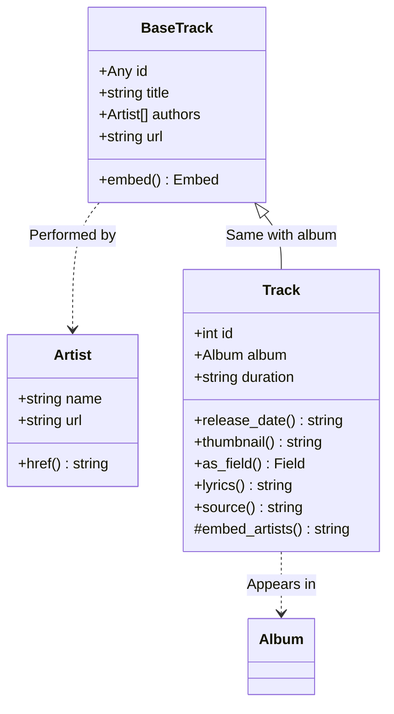

```mermaid
classDiagram
BaseTrack ..> Artist : Performed by
BaseTrack <|-- Track : Same with album
Track ..> Album : Appears in

class Artist {
    +string name
    +string url
    +href() string
}

class BaseTrack {
    +Any id
    +string title
    +Artist[] authors
    +string url
    +embed() Embed
}

class Track~BaseTrack~{
    +int id
    +Album album
    +string duration
    +release_date() string
    +thumbnail() string
    +as_field() Field
    +lyrics() string
    +source() string
    #embed_artists() string
}
```
